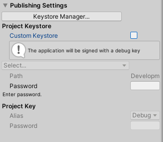
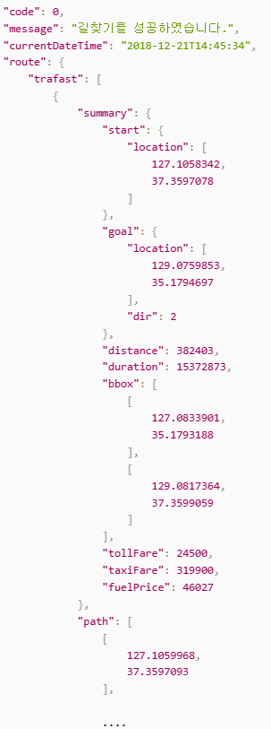

<!--
**iven612/iven612** is a ✨ _special_ ✨ repository because its `README.md` (this file) appears on your GitHub profile.

Here are some ideas to get you started:

- 🔭 I’m currently working on ...
- 🌱 I’m currently learning ...
- 👯 I’m looking to collaborate on ...
- 🤔 I’m looking for help with ...
- 💬 Ask me about ...
- 📫 How to reach me: ...
- 😄 Pronouns: ...
- ⚡ Fun fact: ...
-->

<h2 align="left">
 <abc>
   Hi there!  
    I'm YuJung An, New Developer! :computer: 
   
    
 </abc>
</h2> 
<h2 align="left">:hammer_and_wrench: Technologies and Tools I use:</h2>

 
<h2 align="left">👨🏻‍💻 About Me:</h2>

- :computer: 
- :hourglass_flowing_sand: 
- :rocket: 
- :man_technologist: 
- :dart:
- :trophy:
- :zap:

<h2 align="left">:heart: Let's get connected:</h2>

 

## Station J Project

    
Click to see more!

 
# AR Navigation
> 제물포 역을 기준으로 지도를 생성하여 유저가 제물포 주변에 있는 시설들을 잘 이용 할 수 있도록 AR Navigation, PhotoZone 등, 다양한 정보를 제공하는 Android Application입니다.
AR기술을 활용하여 => 네비게이션 사용시 실시간으로 바닥에 화살표를 띄워 유저에게 직관적으로 길을 알려주고 포토존이나 특정 랜드마크에 가면 3D 오브젝트와 촬영을 하거나
해당 랜드마크의 설명을 위해 3D 캐릭터가 등장해 설명을 해주는 등각종 상호작용도 할 수 있도록 기획 되어 있습니다.

## 상태 및 전제조건
> Unity Version: 2022.3.2f1

> Platform: Android

> 지원 기기: [ARCore 지원기기](https://developers.google.com/ar/develop?hl=ko#supported_devices)

## 시작하는 방법

### ARCore Extension Package 사용법
Unity의 AR 파운데이션 패키지에 기능을 추가하여 앱에서 클라우드 앵커, 카메라 구성 필터, 녹화 및 재생과 같은 기능을 사용할 수 있도록 합니다.
> 프로젝트에서 Window > Package Manager > Unity Registry > 검색창에 'ARCore XR 플러그인'을 입력 > Install > Edit > Project Settings > XR 플러그인 관리 > Android > ARCore를 사용 설정합니다.

### Google Cloud Platform API사용법
Google Cloud API는 Google Cloud Platform 서비스에 대한 프로그래매틱 인터페이스입니다. Google Cloud Platform의 핵심 요소로, 컴퓨팅, 네트워킹, 스토리지, 머신러닝 기반 데이터 분석 등 모든 기능을 애플리케이션에 쉽게 추가할 수 있습니다.
> Google Cloud Console API 라이브러리 > 사용할 프로젝트를 선택 > 사용할 API를 선택(API를 찾는 데 도움이 필요한 경우 검색 필드 및/또는 필터를 사용) >  API 페이지에서 ENABLE을 클릭합니다.

### Geospatial API 사용방법
Geolocation API는 모바일 클라이언트가 감지할 수 있는 휴대폰 기지국 및 Wi-Fi 액세스 포인트가 포함된 HTTPS 요청을 수락하는 서비스입니다. 이 메서드는 위도/경도 좌표와 유효한 각 입력에 대한 결과의 정확성을 나타내는 반경을 반환합니다.
> Edit(수정) > Project Settings. > XR 플러그인 관리 > ARCore 확장 프로그램 > Geospatial이 선택되어 있는지 확인 > API 사용자 인증 정보를 입력
#### 사용설정 및 API Key 사용 설명
API 키는 사용 및 결제에 관한 프로젝트와 관련된 요청을 인증하는 고유 식별자입니다. 프로젝트에 연결된 API 키가 하나 이상 있어야 합니다.
> Google Maps Platform > 사용자 인증 정보사용자 인증 정보 만들기 > API 키 > API 키 생성 완료

### Geospatial Creator API 사용방법
Unity용 ARCore Geospatial Creator를 사용하면 Google 지도 데이터를 새로운 3D 타일 형식으로 표시하여 Unity 편집기에서 지리정보 콘텐츠를 미리 볼 수 있습니다. 이를 통해 앱을 빌드하는 동안 실제로 콘텐츠가 배치될 위치를 시각화할 수 있습니다.
> Geospatial API 사용방법에서 Cesium 패키지를 추가
#### Cesium Package 설치
> Unity용 Cesium .tgz의 최신 버전 [GitHub 출시 페이지](https://github.com/CesiumGS/cesium-unity/releases/)에서 다운> Window > Package Manager > tarball에서 패키지 추가 > Cesium for Unity .tgz 파일을 선택
#### 사용설정
> Build Settings에서 Android 또는 iOS 인지 확인 > Project Settings > XR Plug-in Management > ARCore Extensions(ARCore Android 또는 iOS API 키를 설정하지 않았다면 지금 설정) > Geospatial 및 Geospatial Creator 전환 버튼을 모두 사용 설정

### Naver API 사용 설명
네이버 클라우드 플랫폼에서는 서비스와 솔루션을 효과적으로 사용할 수 있도록 API(Application Program Interface)와 SDK(Software Development Kit)를 제공하고 있습니다. 동작에 따라 파라미터 값을 입력, 등록, 수정, 삭제, 검색할 수 있습니다. 또한 서비스 및 운영 도구의 자동화에도 활용할 수 있습니다. 일반적으로 XML 및 JSON 형식으로 응답하는 API URL 형식입니다. 크게 기본 API, 호환 API, 연동 API로 분류됩니다.
#### Direction5 API
Directions 5 API는 REST 형식을 따르는 네이버 지도 인터페이스로 HTTP GET 메소드를 이용하여 출발지-목적지 간의 경로 정보를 요청하고 응답으로 경로 데이터 배열을 반환 받습니다. Directions 5 API는 경유지를 5개까지 입력할 수 있습니다. 단, Direction 5 API가 제공하는 경로 정보는 자동차에 한해서만 제공됩니다.
#### Static map API
Static Map API는 REST 형식을 따르는 네이버 지도 인터페이스로 HTTP GET 메소드를 이용하여 네이버 지도 이미지를 받을 수 있습니다. Static Map API를 사용하면 JavaScript 또는 동적 페이지 로드 없이도 웹 페이지에 네이버 지도 이미지를 불러올 수 있습니다. Static Map API는 지도 위치, 지도 크기, 지도 유형, 줌 레벨, 해상도, 지도 포맷, 마커 등 다양한 요청 파라미터를 지원하기 때문에, 원하는 지도 이미지를 받을 수 있습니다.
#### API Key
네이버 클라우드 플랫폼 API를 사용하기 위해서는 먼저 인증키를 생성해야 합니다. 인증키는 권한이 있는 사용자만 API를 호출할 수 있도록 사용자를 식별하는 도구입니다. 와 의 쌍으로 구성됩니다. API 인증 중에 전달되는 매개 변수로 사용됩니다.

### 안드로이드 빌드 설정

배웠으나 사용하지 않음

## 해당 프로젝트 사용해 개발
### ROI 변경 방법
### Directions5 Json 구조

### Static map API 링크
> [Link](https://developers.google.com/maps/documentation/maps-static/overview?hl=ko)

## 작업 노션
[Station J Notion](https://narrow-eyeliner-36a.notion.site/AR-041ece6a6e2a4e5f88f0b391804324bf?pvs=4)

## License
### License.md

